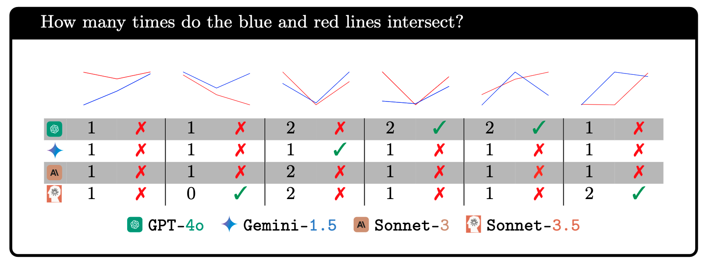
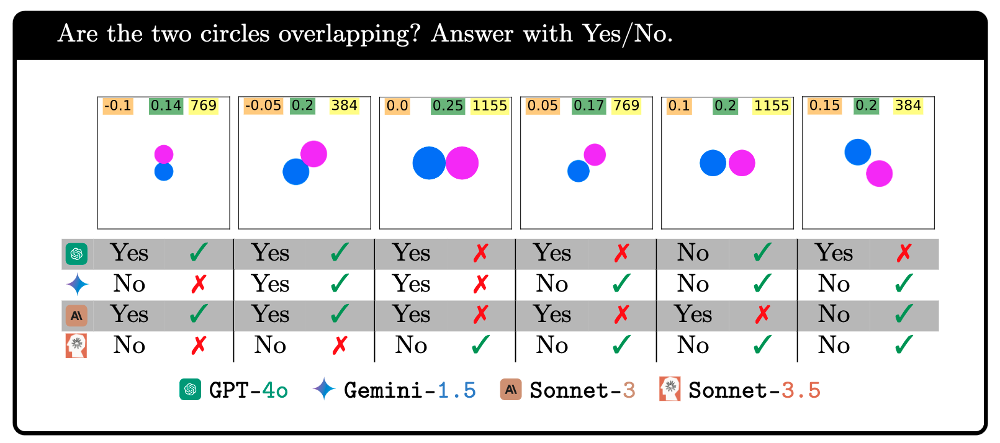
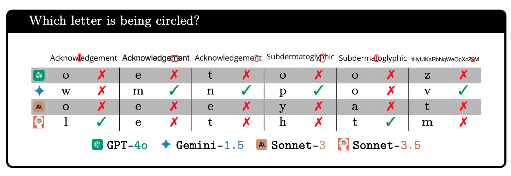
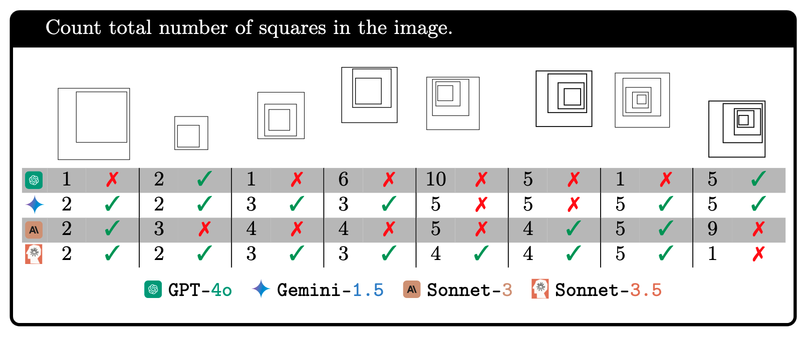
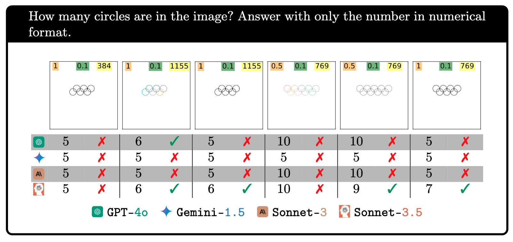
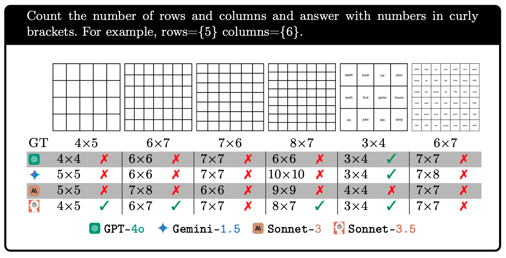
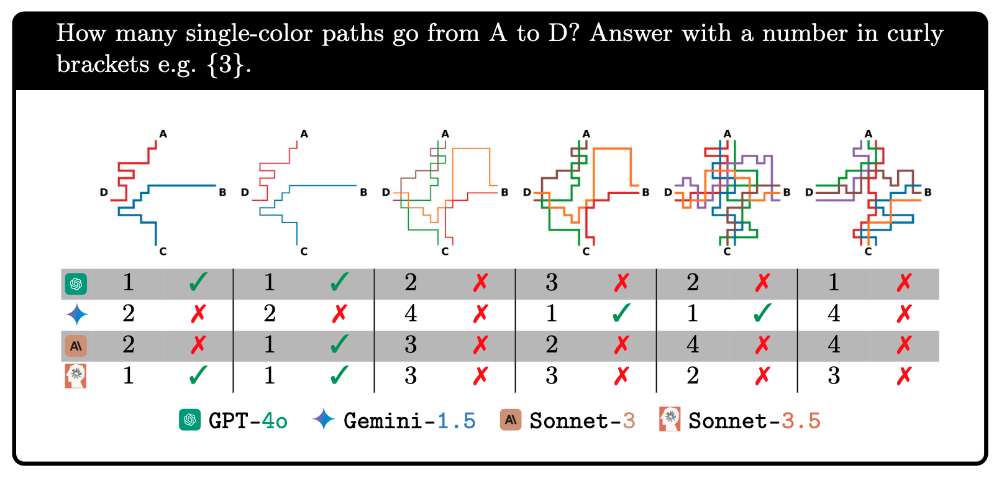

# Vision Language Models Are Blind

    
    
 by 
        <a href="https://pooyanrg.me">Pooyan Rahmanzadehgervi</a>1,*, 
        <a href="https://loganbolton.github.io/">Logan Bolton</a>1,*,
        <a href="https://taesiri.ai">Mohammad Reza Taesiri</a>2, 
        <a href="https://anhnguyen.me/research/">Anh Totti Nguyen</a>1
    

    

        *Equal contribution 
        1Auburn University, 2University of Alberta
    

    

    

This repository contains the code and data for the paper `Vision Language Models Are Blind`.

## Abstract

*While large language models with vision capabilities (VLMs), e.g., GPT-4o and Gemini 1.5 Pro, are powering various image-text applications and scoring high on many vision-understanding benchmarks, we find that they are surprisingly still struggling with low-level vision tasks that are easy to humans. Specifically, on BlindTest, our suite of 7 very simple tasks such as identifying (a) whether two circles overlap; (b) whether two lines intersect; (c) which letter is being circled in a word; and (d) counting circles in an Olympic-like logo, four state-of-the-art VLMs are only 58.12% accurate on average.
Claude 3.5 Sonnet performs the best at 74.01% accuracy, but this is still far from the human expected accuracy of 100%. Across different image resolutions and line widths, VLMs consistently struggle with tasks that require precise spatial information and recognizing geometric primitives that overlap or are close together. Code and data are available at: https://vlmsareblind.github.io*

## How to Reproduce Results

1. Find images in `src/{task}` directory. For example: [this image](https://github.com/anguyen8/vision-llms-are-blind/blob/main/src/TouchingCircle/images/touching-prompt/gpt-4o/incorrect/gpt_touch_pixels_1155_rotation_diagonal_1_diameter_0.14_distance_0.05.png) in the [gpt-4o/incorrect folder](https://github.com/anguyen8/vision-llms-are-blind/blob/main/src/TouchingCircle/images/touching-prompt/gpt-4o/incorrect/).

2. Locate corresponding prompts in [prompts.md](https://github.com/anguyen8/vision-llms-are-blind/blob/main/src/prompts.md). For example: `Are the two circles touching each other? Answer with Yes/No.`

3. Input the above input image and prompt to models via default API settings or official playground, NOT using their web interface (e.g. use https://platform.openai.com/playground/chat for GPT-4o)

5. Compare your results with our paper, noting that variations may occur due to the default `temperature = 1` setting.

**Important**: Using the web interface (e.g., chatgpt.com) of the models may result in very different results from our paper.

## Tasks in the BlindTest benchmark

1. [Task 1: Counting Line Intersection](./src/LineIntersection/)
1. [Task 2: Two Circles](./src/TouchingCircle/)
1. [Task 3: Circled Letter](./src/CircledWord/)
1. [Task 4: Counting Circles](./src/CountingCircles/)
1. [Task 5: Counting Nested Squares](./src/NestedSquares/)
1. [Task 6: Counting Rows and Columns](./src/CountingRowsAndColumns/)
1. [Task 7: Following color-coded paths](./src/SubwayMap/)

## Benchmark Results

### Mean Accuracy - All Tasks

| Model          | Task 1  | Task 2  | Task 3  | Task 4  | Task 5  | Task 6  | Task 7  | Task 8  | Task Mean  |
|----------------|---------|---------|---------|---------|---------|---------|---------|---------|------------|
| Random         |  33.33  |  50.00  |   5.77  |  20.00  |  20.00  |  25.00  |   4.55  |  33.33  |    24.00   |
---------------------------------------------------------------------------------------------------------------
| GPT-4o         |  41.61  |  72.67  |  70.18  |  42.50  |  17.50  |  55.83  |  39.58  |  46.08  |    48.25   |
| Gemini-1.5 Pro |  66.94  |  92.78  |  92.81  |  87.08  |  19.37  |  80.00  |  39.39  |  36.84  |    64.40   |
| Sonnet 3.0     |  43.41  |  84.52  |  73.34  |  31.66  |   9.79  |  65.00  |  36.17  |  22.66  |    45.81   |
| Sonnet 3.5     |  75.36  |  91.66  |  89.22  |  44.16  |  77.29  |  92.08  |  74.26  |  48.04  |    74.01   |
|----------------|---------|---------|---------|---------|---------|---------|---------|---------|------------|
| **Mean**       |  56.84  |  85.41  |  81.39  |  51.35  |  30.99  |  73.29  |  47.35  |  38.41  |    58.12   |

<!-- ### Task 1 - Counting Line Intersection

| Thickness | GPT-4o | Gemini-1.5 Pro | Sonnet 3.0 | Sonnet 3.5 |
|---------------|--------|----------------|------------|------------|
| 2             | 45.00  | 70.00          | 64.00      | 80.00      |
| 3             | 47.00  | 68.00          | 66.00      | 79.00      |
| 4             | 54.00  | 71.00          | 62.00      | 73.00      |
| **Average**   | 48.67  | 69.67          | 64.00      | **77.33**  | -->

<!-- ### Task 2 - Two Circles

|                | GPT-4o | Gemini-1.5 Pro | Sonnet 3.0 | Sonnet 3.5 |
|----------------|--------|----------------|------------|------------|
| Overlapping    | 71.27  | **93.30**      | 88.09      | 88.83      |
| Touching       | 74.10  | 92.26          | 80.95      | **94.49**  |
| Average        | 72.69  | **92.78**      | 84.52      | 91.66      | -->

<!-- ### Task 3 -  Circled Letter

| Word                           | GPT-4o | Gemini-1.5 Pro | Sonnet 3.0 | Sonnet 3.5 |
|--------------------------------|--------|----------------|------------|------------|
| Acknowledgement                | 69.03  | 97.50          | 82.64      | 91.11      |
| Subdermatoglyphic              | 63.60  | 91.05          | 71.45      | 94.49      |
| tHyUiKaRbNqWeOpXcZvM           | 77.92  | 89.90          | 65.94      | 82.08      |
| **Average**                    | 70.18  | 92.81          | 73.34      | 89.22      | -->

<!-- ### Task 4 & 5 - Counting Circles and Nested Squares

|          | GPT-4o | Gemini-1.5 Pro | Sonnet 3.0 | Sonnet 3.5     |
|----------|--------|----------------|------------|----------------|
| Squares  | 48.33  | 80.00          | 55.00      | **87.50**      |
| Circles  | 42.50  | 20.83          | 31.66      | **44.16**      |
| Pentagons| 19.16  | 9.16           | 11.66      | **75.83**      | -->

<!-- ### Task 6 - Counting Rows and Columns

| Grid type | GPT-4o       | Gemini-1.5 Pro | Sonnet 3.0    | Sonnet 3.5      |
|-----------|--------------|----------------|---------------|-----------------|
| Blank     | 26.13        | 26.51          | 25.00         | 59.84           |
| Text      | **53.03**    | **52.27**      | **47.34**     | **88.68**       |
| Average   | 39.58        | 39.39          | 36.17         | 74.26           | -->

<!-- ### Task 7 -Following color-coded paths

| Paths  | GPT-4o           | Gemini-1.5 Pro | Sonnet 3.0     | Sonnet 3.5      |
|--------|------------------|----------------|----------------|-----------------|
| 1      | 67.50            | 85.41          | 23.75          | **95.00**       |
| 2      | 44.37            | 28.75          | 37.18          | **56.25**       |
| 3      | **36.71**        | 25.78          | 15.42          | 25.39           |
| Average| 45.89            | 40.01          | 23.78          | **50.18**       | -->

