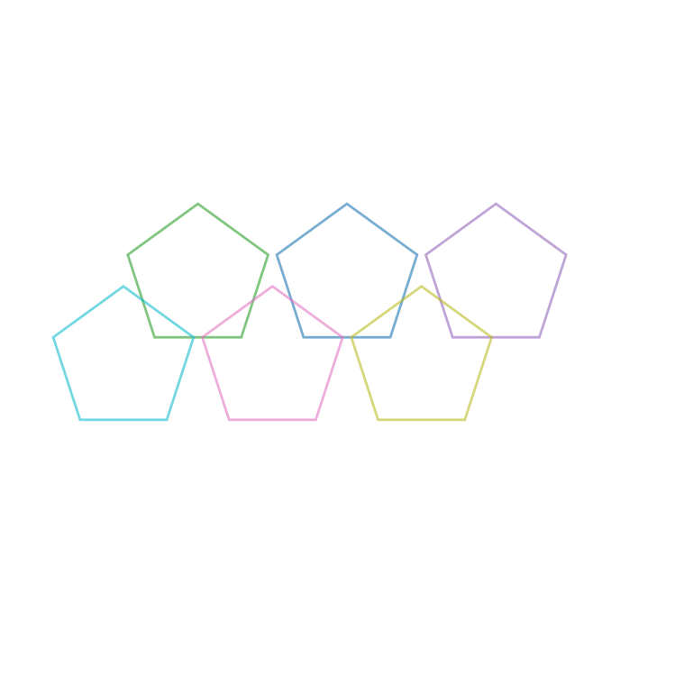
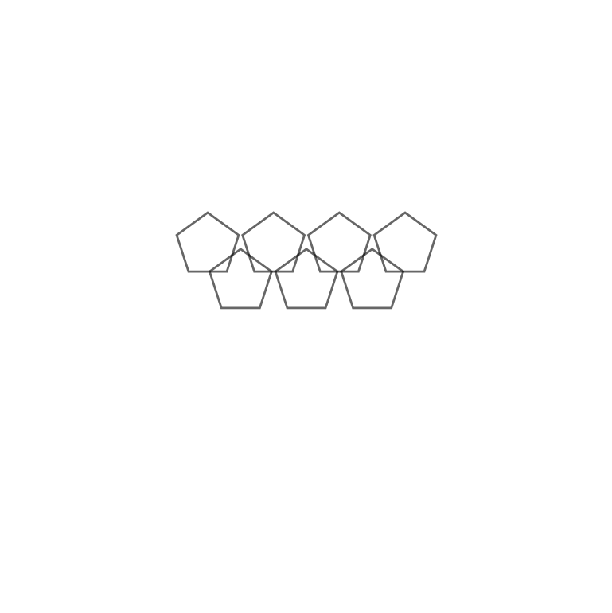
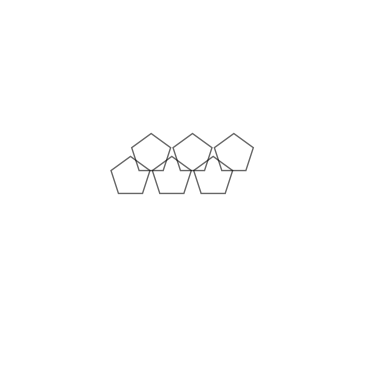
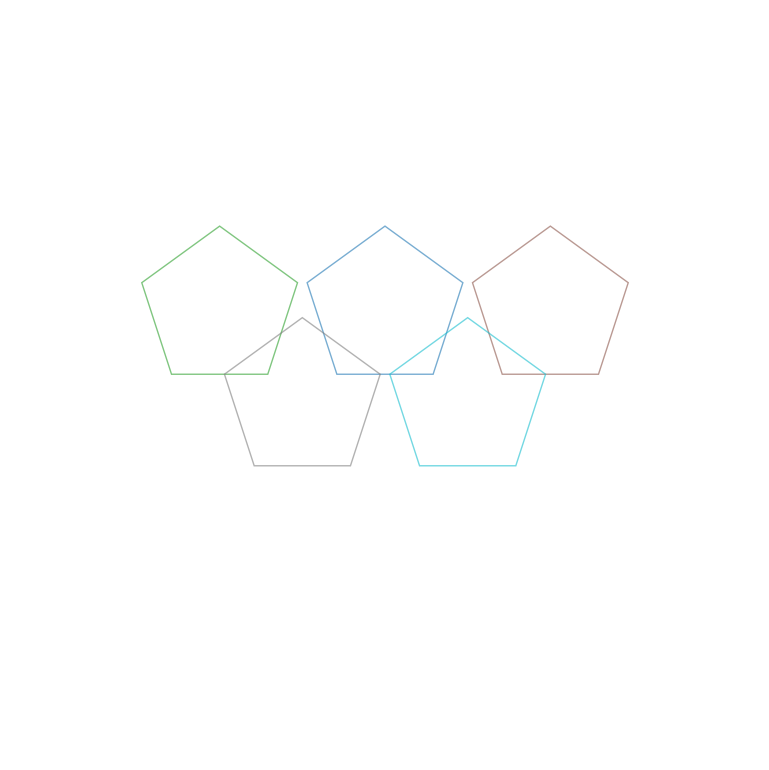

# Task 4: Counting overlapping shapes in an Olympic-like logo

## Counting overlapping circles

### Image generation

`OlympicCircles.ipynb`: notebook contains scripts to generate images of 5 to 9 circles that overlap partially.

### Examples

## Counting overlapping pentagons

### Image generation

`OlympicPentagons.ipynb`: you can use this notebook to simply replace circles with pentagons.

### Examples

